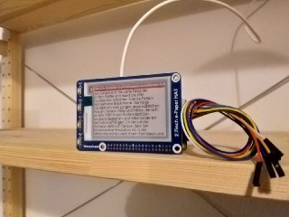

# Wikipedia Article of the Day on Raspi E-paper Hat 
Shows the Wikipedia article of the day on an Waveshare e-paper display on a Raspberry Pi


## Dependencies
```
sudo apt install python3-pip
pip3 install spidev RPi.GPIO feedparser
```

## Deployment
The display should refresh on reboot and every morning at 5 am.
`crontab -e` add this:
```
0 5 * * * /usr/bin/python3 /home/pi/wikipediaArticleOfTheDay/main.py
@reboot /usr/bin/python3 /home/pi/wikipediaArticleOfTheDay/main.py
```
